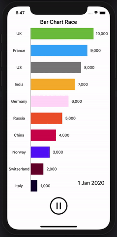

# BarChartRace

[](https://travis-ci.org/OctagonMobile/BarChartRace)
[](https://cocoapods.org/pods/BarChartRace)
[](https://cocoapods.org/pods/BarChartRace)
[](https://cocoapods.org/pods/BarChartRace)

## Example

To run the example project, clone the repo, and run `pod install` from the Example directory first.

## Requirements
- iOS 13 or Above
- Swift version 5.0
- Xcode version 11.4 or above

## Installation

BarChartRace is available through [CocoaPods](https://cocoapods.org). To install
it, simply add the following line to your Podfile:

```ruby
pod 'BarChartRace'
```

## Demo



## Author

OctagonMobile

## License

BarChartRace is available under the MIT license. See the LICENSE file for more info.
